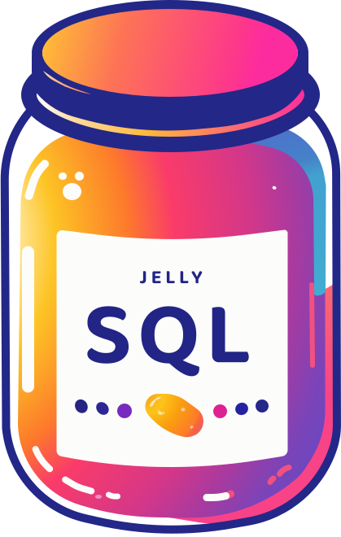

<p align="center">
  
</p>

<br />

<h1 align="center"> Jelly SQL - CSS Query Selectors With SQL </h1>

# 

## About

Query the DOM in JavaScript with a familiar SQL syntax. Generates a CSS query selector that will in turn call the `document.querySelectorAll()`.

## Getting Started

Jelly SQL requires no third-party dependencies. You can use it in the browser or in Node.js. TypeScript is also supported.

Full documentation can be found at [docs.jellysql.com](https://docs.jellysql.com).

### Using `npm` or `yarn`

#### Install


```shell
npm install jelly-sql
```
OR

```shell
yarn add jelly-sql
```

#### Import & Use

See the [API documentation](https://docs.jellysql.com/docs/api) for more information, and the [cheat sheet](https://docs.jellysql.com/docs/selectors/refernece-table) for a quick reference.

```typescript
import { query } from 'jelly-sql';

const selector = query(`SELECT * FROM DOM WHERE TAG = 'a'`);
console.log(selector); // Output: "a"
```

### Using a CDN (Browser)

You can also use Jelly SQL in the browser by including the following script tag:

```html
<script src="https://cdn.jsdelivr.net/npm/jelly-sql@latest/build/dist/jelly-sql.min.js"></script>
```

#### Usage

This will expose the `jellySQL` object globally, which you can use to query the DOM. See the [API documentation](https://docs.jellysql.com/docs/api) for more information, and the [cheat sheet](https://docs.jellysql.com/docs/selectors/refernece-table) for a quick reference.


```javascript
const selector = jellySQL.query(`SELECT * FROM DOM WHERE TAG = 'a'`);
console.log(selector); // Output: "a"
```

## Local Development

> `npm run-script <keyword>`

- `dev` - starts dev server
- `build` - generates the following bundles: ESM (`.js`) and IIFE (`.iife.js`). The name of bundle is automatically taken from `package.json` name property
- `test` - starts vitest and runs all tests
- `test:watch` - starts vitest and runs all tests, but watch for changes & rerun when changes detected
- `test:coverage` - starts vitest and run all tests with code coverage report
- `lint:scripts` - lint `.ts` files with eslint
- `lint:styles` - lint `.css` and `.scss` files with stylelint
- `format:scripts` - format `.ts`, `.html` and `.json` files with prettier
- `format:styles` - format `.cs` and `.scss` files with stylelint
- `format` - format all with prettier and stylelint
- `prepare` - script for setting up husky pre-commit hook
- `uninstall-husky` - script for removing husky from repository

## Acknowledgement

- Get things going: [kbysiec/vite-vanilla-ts-lib](https://github.com/kbysiec/vite-vanilla-ts-lib-starter)

## License

Source code is licensed under [MIT](LICENSE)